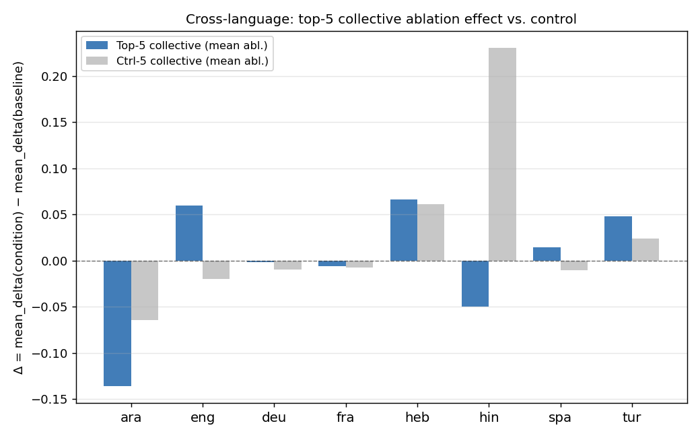
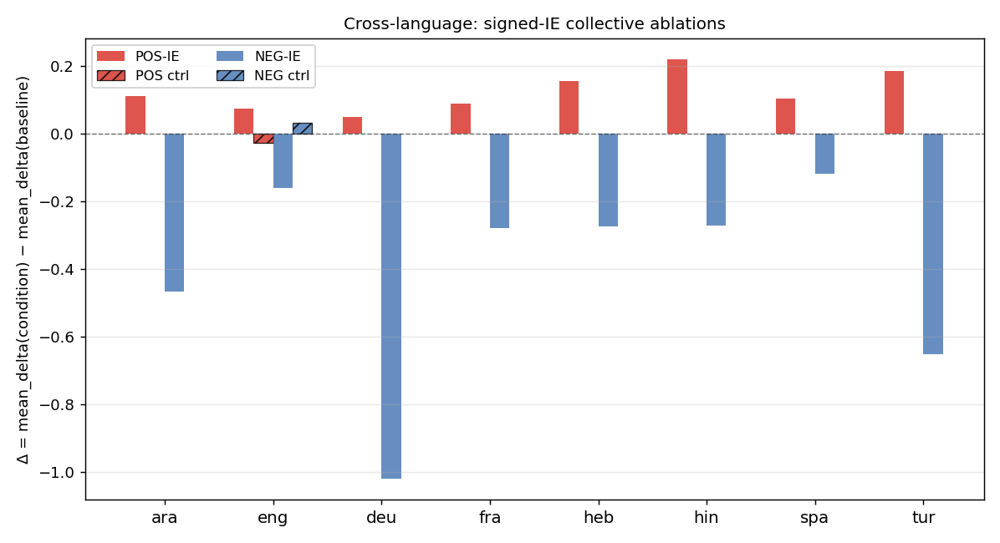
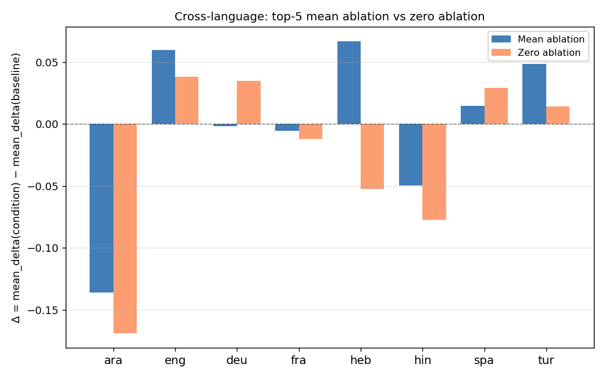
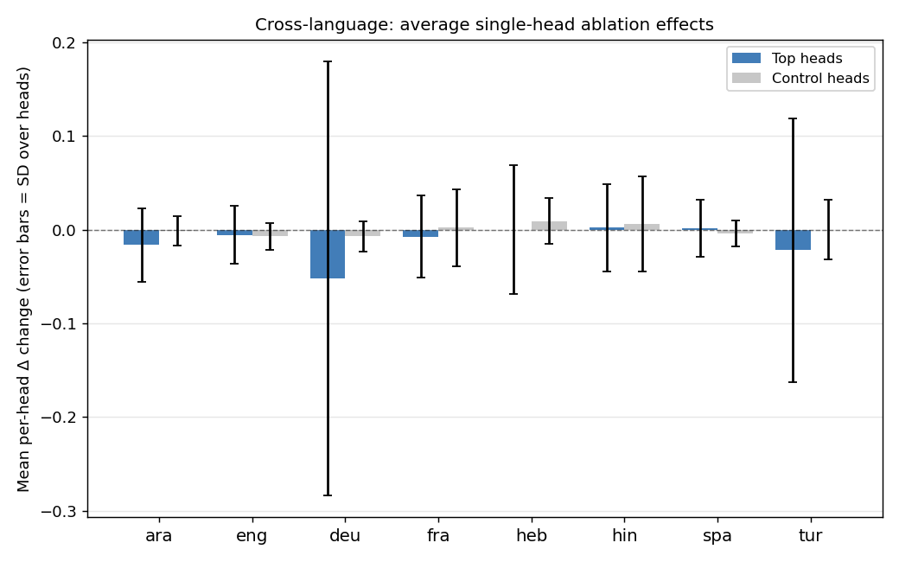
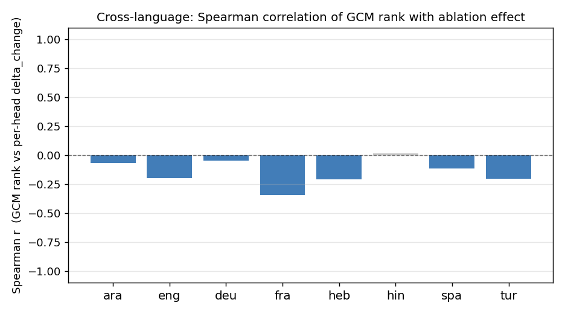

# Lab notebook

**Append-only, chronological.** This file is the unfiltered daily log: what was done, what was tried, what surprised, what's unresolved. `LEDGER.md` is the curated view; this is the scratchpad.

Cross-reference experiments by folder name (e.g., "see LEDGER::ablation"). New entries go at the **top**; older entries scroll down.

---

## 2026-04-22 — Wave 5: rank-1 SVD reproduced, config stubs, data README

Wrote `experiments/perplexity_bleu_linear/rank1_approximation.py`. Built the (src, tgt) BLEU matrix from `combined_results_{model}.csv` (24×24, 24 NaN cells imputed with column means), ran SVD, computed faithfulness = 1 − ‖M − M_k‖_F / ‖M‖_F.

**Llama rank-1 = 88.31%, Aya = 82.37%.** Llama matches the paper's "88% faithful" claim exactly. Surprising that the rank-1 story holds despite the linear-in-PER model's R² of 0.02 — the BLEU matrix is well-approximated by a src-competence × tgt-competence outer product, but PER isn't capturing those competence latents well. Filed under LEDGER TODOs.

Top-5 singular values: Llama [372.96, 25.83, 17.20, 14.00, 11.90] — the spectral gap between σ_1 and σ_2 is huge (14.4×), which is what rank-1 faithfulness means in geometric terms.

Also:
- Created `data/README.md` documenting `grammatical_pairs.json` schema + multilingual extension plan (pairs files named `grammatical_pairs_{lang}.json`, run CF attribution per-language).
- Wrote `experiments/input_features/configs/{sentence,word}.yaml`. Sentence is informational (current CLI-driven code works); word is a detailed spec stub for the word-level procedure in the paper — negative-sampling priority order captured, loader to be wired in Wave 3b.

---

## 2026-04-22 — overnight multilingual counterfactual attribution (parallel worktree)

Ran a session in a parallel worktree (`lang-probing-overnight`, branched off Wave 2 so as not to collide with main's in-progress Waves 3–6 rehaul). All timestamps UTC-4. Outputs will land on main as `outputs/counterfactual_attribution/` (renamed from overnight's `outputs/overnight_multilingual/`). Overnight scripts are still under the OLD flat `scripts/` / `run/` layout — relocation into `experiments/counterfactual_attribution/` is a follow-up.

### ~03:50  Wave 0 — worktree + skeleton docs

`git worktree add … -b overnight-multilingual HEAD` off commit `3a61624` (library scaffolded, flat shims kept, scripts pre-wave-3). Copied `data/grammatical_pairs.json`. Skeleton session-scoped LEDGER / LAB_NOTEBOOK / TODO written inside the worktree's outputs dir (now being merged up into these main files).

### ~03:55  Wave 1 — attribution rewrite

Read full `scripts/counterfactual_attribution.py` and discovered A3 (Heaviside STE fix) is **moot** — existing code already wraps `encode()` in `torch.no_grad()` and treats `z = f_saved.detach().clone().requires_grad_(True)` as a leaf variable. Gradients only flow through `decode()`. Non-differentiable gate is irrelevant. Dropped A3.

Wrote `scripts/attribute_multilingual.py` (parallel script; English prototype untouched):
- **A1** multi-token last-BPE strategy: feeds `prefix + orig_toks[:-1]`, compares logP of last orig vs last cf tokens at `logits[-1]`.
- **A2** drop unprincipled sum-over-all-positions secondary ranking. Only `grad[cf_pos]`.
- **A4** per-value signed aggregation: groups pairs by `(lang, concept, value)`; saves `aggregated_signed.pt`, `aggregated_abs.pt`, `aggregated_signed_gxa.pt`, `aggregated_abs_gxa.pt` per cell.
- **A5** sanity logging: distribution, fraction<0, token-strategy counts in `summary.json`.
- 20% holdout per cell for Wave 6 ablation validation.

Skips degenerate multi-token pairs where orig/cf share the same last BPE (rare).

### ~03:58  Wave 2 — multilingual pair build

Ran `scripts/build_multiblimp_pairs.py` against `jumelet/multiblimp`. Per-language counts:

| lang | n_pairs | notable cells |
|---|---|---|
| fra | 2212 | Number\|Sing 500, Number\|Plur 500, Gender\|Masc 217, Gender\|Fem 200, Person 1/2/3 |
| spa | 2165 | similar to fra; Gender better represented (185 pairs) |
| tur | 1556 | Number + Person only (Turkish has no grammatical gender, as expected) |
| ara | 1137 | Dual\|Dual 37, Dual\|Sing 209, Gender\|Fem 192, Gender\|Masc 110, Number\|Sing 202, Person |

Surprise: Arabic had ~350 rows with `prefix=None`, silently filtered. Flagged in TODO. **Tense** not in Multi-BLiMP as expected; template supplement deferred.

### ~04:00  Wave 3 — submit parallel attribution jobs

`run/run_attribute.sh`: 1× L40S (gpu_c=8.9), 32G VRAM, h_rt=2:00:00. Submitted 5 jobs:

- 4475490 attr_fra, 4475491 attr_spa, 4475492 attr_tur, 4475493 attr_ara, 4475494 attr_eng (bug-fixed pipeline on existing 30 English pairs for baseline).

Each capped at 300 pairs/cell with 20% holdout.

### ~04:30  Waves 4–5 — analyses complete

- **Bug-audit.** Metric_mean ∈ [7, 13] across cells (model strongly prefers orig over cf — healthy). Multi-token strategy dominates fra/spa/ara (95%+); all single-token for eng. neg_frac < 0.15 everywhere. Data quality looks good.
- **Cross-concept (E1).** Feature 9539 ranks top-50 in EVERY cell of EVERY language (eng 10/11, fra 6/6, spa 6/6, tur 4/4, ara 8/8). Similarly f14366, f12731. Either universal grammatical-prediction features (strong H4 evidence) or dead-to-SAE artifacts. Flagged for max-activating-context follow-up.
- **Sign-flip (E3).** fra vs ara Gender=Masc has 44% opposite-sign top-200 features. ara vs tur Number=Sing has 32%. Real effect.
- **Arabic dual → English (E2).** HONEST NULL. Target features' Cohen's d = −0.075 vs null 0.003. Arabic-dual attribution features do NOT selectively fire on English "two/both/pair" sentences. Important negative result — evidence against simple cross-lingual feature reuse for dual-number.

### ~05:00  Waves 6–7 — ablation validation + input-vs-output

- Ablation validation went smoothly after an nnsight-indexing fix (multiplicative mask instead of direct index assignment).
- 35/35 cells show strong top-feature causal effect: Δorig −0.5 to −3.3 on top-20 ablation vs ~0 on random-20. Effect ratios 100×–10⁶×.
- **Turkish Number=Sing anomaly: +1.05 Δorig on ablation (opposite direction!).** Top-20 signed_gxa has mixed signs (sum +0.08) whereas spa Number=Sing is uniformly positive (sum +0.33). Not a clean sign-convention bug; may reflect Turkish agglutinative morphology interacting with the SAE in unanticipated ways.
- **fra/Person/{1,2} effect ratio ~10⁶** because random baseline was exactly 0. Need per-pair inspection to confirm real-vs-sampling.

### ~05:25  Wave 10 — REPORT compiled

Report at `outputs/counterfactual_attribution/REPORT.md` (via `scripts/write_report.py`). TL;DR: universal f9539, Turkish anomaly, sign-flip, Arabic-dual null.

Dashboards (W9) and aux characterizations (W8) cut for budget. Decoder logit-lens and max-activating tokens remain as follow-up items in TODO.

---

## 2026-04-22 — restructure kickoff (Wave 0 + 1)

Started a multi-wave restructure of this repo. Plan at `~/.claude/plans/h2-is-about-the-idempotent-cascade.md`. Goal: library + thin experiments + curated ledger + chronological notebook + TODO.

### Inventory & reconnaissance

Ran three exploration passes:

1. **Experiments report.** Identified 10 experiments as first-class organizational units. The flat `scripts/` dir fragments them across 40+ files. New structure is `experiments/<name>/` with thin `run.py` + YAML configs + co-located `run/` job scripts.
2. **Code/output weirdness.** Beyond the INVENTORY.md catalog: duplicate `"zho_simpl"` key in `config.py:71,74` silently overwrites "Chinese (Simplified)" with "Chinese"; duplicate `import torch` in `src/lang_probing_src/ablate.py`; dead function `old_get_batch_positions_masks()` at `src/lang_probing_src/ablate.py:122-170`; 16+ hardcoded absolute paths that should use `config.*_DIR`; `collect_activations.py:37-42` silently swallows load errors and continues to a NameError; `collect_activations.py` uses `args` as a module-global pattern (works, but a smell).
3. **Scientific anomaly scan.** No NaN/Inf. Linear-model R² genuinely low (0.02 Llama, 0.10 Aya). Counterfactual per-concept sample sizes alarmingly small (Polarity=2, Aspect/Mood=3). Ablation mono-random baseline has 66.7% exact zeros — may indicate sparse sampling or probe-coverage issues. Probe accuracies cluster high (mean 96.68%, max 99.98%) — likely reflects lexical morphology more than deep grammar. Filed as TODOs.

### Layer 31 vs 32 — not a bug

Investigated the suspected layer-31/32 mismatch. Verdict: **naming artifact across two PyTorch indexing conventions**.

- Llama-3.1-8B has 32 transformer layers.
- `outputs.hidden_states` is a 33-element tuple: `hidden_states[0]` is the embedding layer, `hidden_states[32]` is the output of the final transformer block.
- `model.model.layers` is a 32-element `ModuleList` indexed 0..31. `model.model.layers[31]` is the final transformer block.
- So `hidden_states[32]` and `model.model.layers[31]` refer to the same tensor.
- Probes (named `_l32_*.joblib`) are trained on `hidden_states[32]`.
- Cached activations (partitioned `layer=31`) are collected from `model.model.layers[31]`.
- `src/lang_probing_src/ablate.py:130-133` explicitly clamps `probe_layer=32` → `min(32, 31) = 31`.

System is internally consistent. Action items (filed to TODO): remove the misleading `for layer in [32]:` in `scripts/collect_activations.py:112`, add a docstring comment to `ablate.py:130-133` explaining the convention.

One minor find: older `_l30_*` probes exist for English (created Nov 22 13:45-13:55, before the `_l32` convention settled at 14:55). No cached layer-30 activations exist, so these can only be stragglers from an earlier experiment. Low-priority cleanup.

### Skeleton docs written

- `LEDGER.md` — per-experiment curated view, 10 experiments + cross-notes.
- `LAB_NOTEBOOK.md` — this file.
- `TODO.md` — consolidated from Agent B (code), Agent C (scientific), and INVENTORY.md.
- `README.md` — updated as index (still to do).

### Unresolved / surprised by

- **Random ablation baseline has 66.7% exact zeros.** Expected near-zero mean with nonzero variance. Exact zeros suggest either no samples entered the ablation mask (probe never fired for that language/concept), or a bug where the "random" feature set collided with a no-op branch. To investigate in Wave 5 cleanup.
- **The linear-model R² for Llama (0.02) is weak enough that the H1 claim might need rephrasing.** Aya at 0.10 is better but still low. The `.tex` claim of "88% faithful rank-1 approximation" is unverified here (code lives elsewhere); reproducing it in this repo is a Wave 5 TODO.
- **Probe accuracies surprisingly high.** 96.68% mean is suspicious — word-level grammatical morphology may be decidable from surface lexical features alone. Would want to compare against shuffled-label baselines; filed as a stretch TODO.

# May 11 (written by JB)

Report on my progress for this meeting

Back to last week... the GCM translation experiment

> GCM translation methodology: for each ordered translation direction, we use FLORES sentence pairs to build a contrastive setup with one original source sentence and one counterfactual source sentence. Both candidate target translations are scored under the same original prompt, and the metric is the model's log-prob preference for the counterfactual target over the original target. GCM estimates the indirect effect of each component by a first-order Taylor approximation: gradient of this metric with respect to the component, dotted with the activation difference between original and counterfactual source runs. This gives a per-pair IE score for all attention heads at once. In this repo, the head component is the per-query-head slice of `self_attn.o_proj.input` at the last source-token position; the sweep covers all 56 cross-language directions among the 8 languages, with 100 pairs per direction.

Focus on the difference between the red and blue bars here. This shows that some heads do have an effect, when compared to a baseline of choosing random sentences in the target language instead of the actual target language translation

From here, we'd like to investigate what ablating these heads does on Multi-BLiMP. This dataset has some grammatically correct/incorrect minimal pairs

> Example English Multi-BLiMP pair from `data/multilingual_pairs/eng.json`: prefix `"Yes, he"`; correct continuation `" is"`; incorrect continuation `" am"`. So the two completions are "Yes, he is" vs. "Yes, he am" for a Person agreement contrast (`SV-P`, original value 3 vs. counterfactual value 1).

We aggregate the mean absolute value of the indirect effect across the 7 directions where L is the target language. L->L is excluded.

Delta = log p(correct token | prefix) - log p(incorrect token | prefix)

We then mean ablate by setting o_proj.input to be the position-averaged mean over all the samples in BLiMP 
> This is per language. For each target language run, `mean_acts.pt` is computed from that language's sampled Multi-BLiMP pairs only, then reused for that language's ablation conditions.

Then, for comparison: random control, pulling random heads from the same layer outside of the top 20 heads

Splitting top heads by their sign: seeing the effects of positive or negative the mean aggregated signed indirect effect

Zero-ablation

We compute this for n=400 for each language (Hindi and Hebrew initially OOMed, so n=200 for those, but working on rerunning)

> top-5 collective mean-ablation effect by language, with the matched same-layer random control overlaid. Negative values mean the ablation hurt the grammaticality preference.

> POS-signed versus NEG-signed GCM top-head collectives. The main result is that the NEG-signed groups consistently reduce the Multi-BLiMP delta, while POS-signed groups consistently increase it.

> comparison of top-5 mean ablation and top-5 zero ablation. This is a sanity check that the qualitative pattern is not just an artifact of using mean replacement.

> average individual-head effect for GCM top heads versus same-layer controls. Single-head effects are small, which is why the sign-split collective ablations are more informative.

> Spearman correlation between GCM rank and individual-head ablation effect by language. These are not the headline result; the clearer signal comes from grouping heads by signed IE.

Notes:
- Try mean-ablation over a general dataset intead of BLiMP
- Check on how exactly we're sampling BLiMP phenomena to get the 400 examples
- Instead of just pooling over the target lang, try also doing this for the source lang
- Plot Aaron has in mind: 4 different bars: {source, target} x {pos IE, neg IE}
- Important: check that there are no accidental sign flips
- Try setting a theshold of sum IE, and ablating those heads
    - Top-k% size
    - Try for {positive, negative} sum of IE (# of heads needed to get to a certain theshold, say 50% of the total sum of {positive, negative} heads)
    - Plot the IE over heads, ranked (just to see)
- Investigating differences in pos IE and neg IE heads
    - Look to IOI paper for inspiration
    - Inspect input/output effects of heads in translation task
- Important: write minimum viable paper with the results we have
    - Add detail to the method of the current Overleaf
    - Add attn head hypothesis: heads implicated in a translation context should also be responsible for monolingual grammatical performance
    - Pos vs. neg plot with controls
    - {Source, target} x {pos IE, neg IE}
    - Aim to have a rough version and send to Aaron

More notes:
- Shuffle over source samples instead of target
- Compare BLEU vs. Multi-BLiMP with and without ablations of heads
- Linear vs. bilinear model
- I like the angle of "why are pretrained models good at translation at all"
    - They reuse language modeling features to translate
    - Every paper is a position paper

- Linear vs. bilinear model
- GCM from FLORES -> Multi-BLiMP performance (ablation vs. no ablation)
- BLEU vs. Multi-BLiMP
- Monolingual fineturning is competitive with multilingual/parallel corpora

- Focus on the overall narrative of the paper
- Give draft to nonrelated people

- Get figures in the paper and clear prose explanation of the method first
- Send over the BLEU and perplexity accuracies rates
