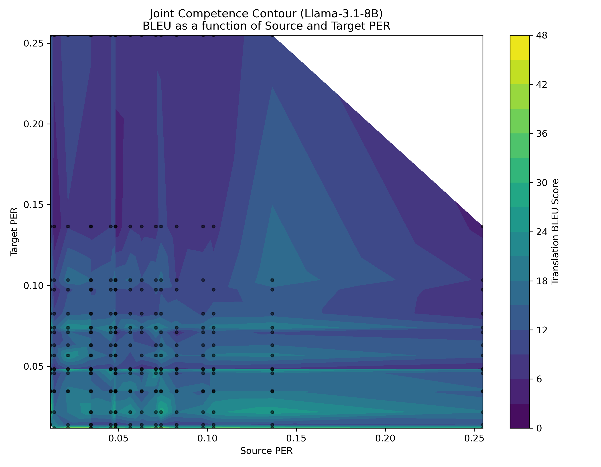
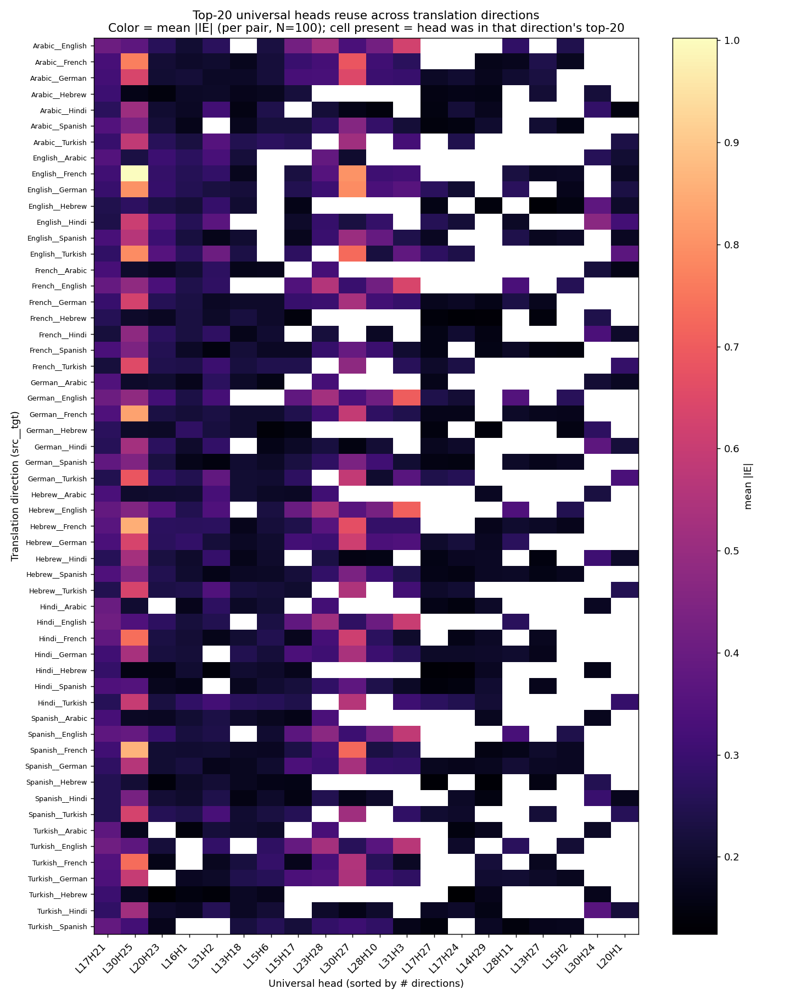
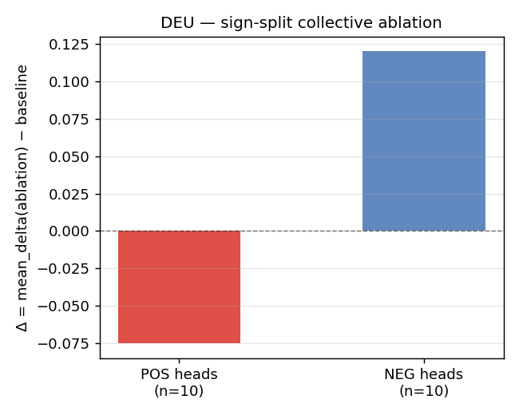
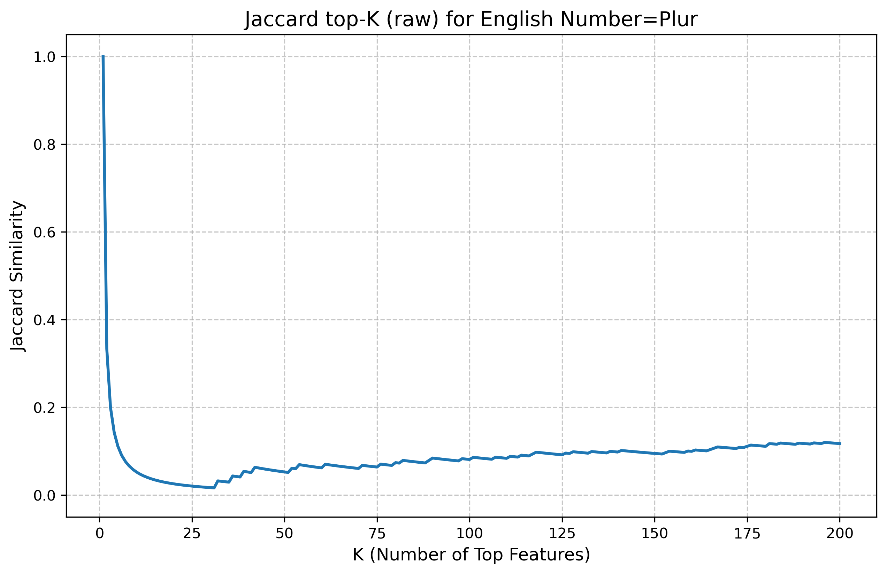

# Phase 1 — Impartial overview of experiments for *"Read, Translate, Write"*

This document inventories what has actually been done in this repo, experiment
by experiment, so the story arc for `reports/v4.tex` can be chosen. For each
experiment: **(1) method front-to-back, (2) what was run, (3) results,
(4) figures with exact generation captions, (5) validity flags.**

Tone is deliberately impartial: finished work is described as finished, pending
work as pending, and anything that looks weak or unverified is flagged rather
than smoothed over. No recommendations. All numbers are cited to their source
doc (REPORT.md / LEDGER.md / README / `outputs/*`); figure captions state the
script and aggregation that produced them. Every embedded figure was confirmed
to exist on disk.

**Paper thesis (from `v4.tex` / LEDGER):** LLMs translate largely by reusing the
monolingual circuits and features they already use for language modeling,
mediated through a "fuzzy semantic hub" of multilingual grammatical features —
rather than via language-pair-specific translation modules.

**The four sub-hypotheses:**
- **H1** — BLEU predictable from monolingual source + target competence, no interaction term needed.
- **H2** — Input feature space ≈ output feature space, across languages ("the noisy channel is multilingual").
- **H3** — Adding a language ≈ improving monolingual capability (monolingual FT ≈ parallel-corpus FT). *Owned by collaborator (Jannik); not in this repo.*
- **H4** — Translation reuses the same monolingual circuits the model uses for language modeling.

**Model substrate (everywhere unless noted):** Llama-3.1-8B (bf16), layer-16
gated SAE `jbrinkma/sae-llama-3-8b-layer16` (32,768 features). Aya-23-8B used as
a comparison point only in the linear-model experiment.

---

# PART A — CORE EXPERIMENTS

These three map directly onto the three empirical sections of `v4.tex`
(§3 linear model, §4 GCM + ablation, §5 finetuning). They get the most depth.

---

## A1. The linear model — `perplexity_bleu_linear` (H1)

*v4.tex §3, "A Motivating Observation: Monolingual Capabilities Explain Translation Performance"*

### Method (front to back)

The question is how much BLEU variance across language pairs is explained by a
function of monolingual competence in the source and target languages alone,
with **no** cross-lingual interaction term. The pipeline (`README.md`,
run in order):

1. **Corpus perplexity per language** (`run_perplexity.py`) — Llama-3.1-8B and
   Aya-23-8B perplexity on the FLORES devtest split, per language.
2. **Perplexity Error Rate (PER) per language** (`run_per.py`) — on Multi-BLiMP
   minimal pairs: the rate at which the model assigns higher probability to the
   ungrammatical member of a minimal pair (a monolingual-competence proxy
   distinct from raw corpus PPL).
3. **Join** BLEU + PPL/PER (`combine_csvs.py`) into `combined_results_{model}.csv`.
4. **Fit OLS** (`run_linear_fit.py`) of the form
   `BLEU ≈ a + β₁·P_src + β₂·P_tgt [+ β₃·P_src·P_tgt]`, with switches for
   raw-vs-log feature transform and inclusion of the interaction term. The
   linear-vs-bilinear comparison is the H1 test: if H1 holds, the bilinear
   (interaction) model should not beat the linear one.
5. **Rank-1 SVD of the BLEU matrix** (`rank1_approximation.py`, added 2026-04-22)
   — assemble the (source × target) BLEU matrix `M`, take its SVD, and measure
   how well a single rank-1 factor reconstructs it:
   `faithfulness = 1 − ‖M − M₁‖_F / ‖M‖_F`. A rank-1 matrix is exactly a
   source-competence vector outer-producted with a target-competence vector —
   i.e. BLEU = (src factor) × (tgt factor) with no interaction. This is a second,
   transform-free operationalization of H1.

**Inputs:** FLORES devtest (`gsarti/flores_101`), Multi-BLiMP (`jumelet/multiblimp`),
external BLEU scores joined per language pair, Llama-3.1-8B + Aya-23-8B.

### What was run

- v1 (2026-02-09): scatter + mixed-LM. v2 (2026-02-20): Pearson/Spearman + PER
  figures. v3 (2026-03-02): OLS fits with interaction toggle (LEDGER).
- Rank-1 SVD: Llama and Aya, 2026-04-22 (README).
- Languages in the PER pass: English, Spanish, French, German, Turkish, Hebrew,
  Hindi, Chinese, Indonesian (README pipeline command).

### Results

- **Linear-in-PER fit is weak:** R² = **0.02 (Llama)**, **0.10 (Aya)** (README
  "Known caveats" + LEDGER). Coefficients are consistently **negative** (higher
  perplexity → lower BLEU, the correct direction), but prediction MAE is ~5–6
  BLEU points and predictions cluster near the intercept (LEDGER).
- **Rank-1 SVD is highly faithful:** **88.31% (Llama)**, **82.37% (Aya)**
  (README). The Llama figure matches the 88% claim in the reference paper.
- **The tension** (stated plainly in LEDGER): a linear-in-PER model explains
  almost no variance (R²≈0.02) while a rank-1 factorization of the BLEU surface
  explains ~88%. LEDGER's own reading: PER is a noisy proxy for the "true"
  competence vectors that the rank-1 factors recover. This reconciliation is
  asserted, not yet demonstrated (no analysis tying the rank-1 factors back to a
  measured competence quantity).

### Figures

All figures live at repo-level `img/perplexity_bleu_linear/` (no experiment-local
`img/`). Captions describe Llama; Aya equivalents exist with the `aya_` prefix.

**Joint competence — scatter.** Each point is one language pair; axes are source
and target competence; point/color encodes BLEU. Produced by
`visualize_correlation.py` from `combined_results_llama.csv`.


**Joint competence — contour.** Same data as the scatter, rendered as a fitted
BLEU surface over the (source competence, target competence) plane. Produced by
`visualize_correlation.py`.



**Perplexity vs BLEU (sorted).** Per-language-pair BLEU plotted against the
perplexity-based competence proxy, sorted. Produced by `visualize_error_bar.py`.


**Rank-1 predicted vs actual.** Scatter of rank-1-SVD-reconstructed BLEU against
actual BLEU per language pair; the 88.31% faithfulness figure. Produced by
`rank1_approximation.py --model llama`.


**Error-vs-rank curve.** Frobenius reconstruction error of the BLEU matrix as a
function of SVD rank; the rank-1 point is the headline. Produced by
`rank1_approximation.py --model llama`.


### Validity flags

- **R²≈0.02 vs rank-1≈88% is unreconciled.** The two operationalizations of the
  same hypothesis disagree by ~4 orders of magnitude in explained variance. The
  PER-noise explanation is plausible but currently an assertion (LEDGER TODO:
  "investigate why PER-based linear model is low-R² but rank-1 ≈88%").
- **Source-of-truth ambiguity.** Two CSVs coexist —
  `perplexity_results_*.csv` (described as a "tiny pilot") and
  `combined_results_*.csv` (~28 KB, "current source of truth"). LEDGER lists
  reconciling them as an open TODO.
- **External BLEU provenance.** BLEU scores are joined from an external source;
  the docs do not specify the decoding setup behind those numbers here.
- **No residual analysis / leave-one-language-out** yet (LEDGER TODOs: plot
  residuals; refit without Turkish/Hebrew to check for dominant outliers).
- **Small N for the matrix.** The rank-1 result is over a modest (src × tgt)
  grid; faithfulness of a rank-1 fit is mechanically high for small matrices, so
  the 88% should be read alongside the matrix dimensions (not stated in README).

---

## A2. GCM head & feature identification — `gcm_translation` (H4)

*v4.tex §4, first half ("Identification of top heads via GCM").* This is the
upstream experiment whose head rankings feed A3.

### Method (front to back)

**Goal.** Localize, at the level of individual attention heads and individual
SAE features, the components that most distinguish the model's preference
between two candidate target translations — and ask whether the same components
recur across many language directions (which would be evidence for shared,
not pair-specific, translation circuitry → H4).

**The estimator (GCM).** Generative Causal Mediation (Sankaranarayanan et al.,
arXiv:2602.16080). For a contrastive triple `(p_orig, r_orig, r_cf)` — one
prompt, two candidate responses — the indirect effect of a component `z` is how
much patching `z` changes the metric

```
M(z) = log π(r_cf | p_orig, z) − log π(r_orig | p_orig, z)
```

where each `log π(r | p)` is the teacher-forced sum of per-token log-probs.
Activation patching measures this with one forward pass per component
(expensive). GCM's contribution: under a first-order Taylor expansion of `M` in
`z`, the indirect effect of swapping `z_orig → z_cf` is

```
IE_hat(z) = ∇_z M |_{z=z_orig} · (z_orig − z_cf)
```

computable for **every** component at once with one forward + one backward pass.

**Interpreting the indirect effect and its sign.** `IE_hat(z)` is the
first-order estimate of how much component `z`, *by itself*, is responsible for
the model's preference between the two candidate translations. It is "indirect"
in the causal-mediation sense: it's the effect that flows *through that one
component* (the mediator) when its activation is swapped from the
counterfactual value `z_cf` to the original value `z_orig`, with everything else
left at its original-input state — not the total effect of changing the input.
- **Magnitude `|IE|`** = how much this component matters for distinguishing
  `r_orig` from `r_cf`. Large `|IE|` ⇒ the component carries a lot of the
  discriminative signal at the patch position; the experiment ranks components
  by `mean(|IE|)` over the 100 pairs.
- **Sign.** Because the metric is `M = m_cf − m_orig`, a swap toward `z_orig`
  that *raises* `M` favors `r_cf`. So **positive IE** ⇒ this component, in its
  original state, pushes the model toward the **counterfactual** (other)
  translation; **negative IE** ⇒ in its original state it pushes toward the
  **gold** translation of the actual source. Read at the head level: a
  **NEG-IE head favors the correct continuation** (it carries "this is the right
  output" signal), a **POS-IE head favors the alternative** (more
  routing/selection-like). This sign convention is exactly what A3 exploits: the
  signed IE predicts the *direction* of the downstream Multi-BLiMP ablation
  effect.

**Contrastive setup from FLORES.** Instead of hand-written contrasts, the
experiment uses real FLORES sentence pairs: `r_orig` is the gold translation of
the original source sentence; `r_cf` is the gold translation of a different
(counterfactual) source sentence. Both are scored under the **same** prompt
`p_orig`. `z_cf` is the activation that the patched component *would* have had
had the model read the counterfactual source. So `IE_hat` measures which
component most moves the model between "prefer the right translation" and
"prefer the other one."

**What counts as a component (two flavors, both attributed every run):**
- **Per-attention-head outputs:** for each layer L and query head h
  (32 × 32 = 1024 components), the slice of
  `o_proj.input[:, last_src_idx, h·head_dim:(h+1)·head_dim]`. GQA caveat: Llama
  has 32 q-heads but 8 kv-heads, so q-heads cluster in groups of 4.
- **Layer-16 SAE features:** all 32,768.

**Patch position.** The **last source token only** (the trailing space after
`Spanish:` in the prompt). This is a deliberate departure from the GCM paper
(which patches all source positions and sums). REPORT §3.3 gives two reasons:
comparability of IE across pairs/directions, and the semantic-hub claim that the
source content has already condensed by this position. REPORT §6 lists this as a
limitation (under-attributes if signal is spread across the source).

**Prompt template.** 2-shot, single-newline separators, ending in a literal
trailing space; FLORES rows 0–1 held out as the fixed shots. The metric scores
**every** target token including the first (REPORT §3.4 argues this is correct
for this template because there is no chat-template newline artifact).

**The nnsight mechanics (post-red-team; see flags).** Two design choices REPORT
documents as the canonical implementation:
- **Two separate single-invoke traces** (one per response), not one multi-invoke
  trace — because nnsight 0.5 left-pads multi-invoke batches, which would shift
  the patched index for the shorter sequence. Gradients accumulate on `z_leaf`
  across the two traces; `∇M = ∇m_cf − ∇m_orig`.
- **Heads patched at `o_proj.output`, not `.input`** — writing to `.input` is
  unsupported in nnsight. Since `o_proj` is linear, replacing an input slice is
  equivalent to adding `(z_leaf − z_orig)·W_oᵀ` to the output. REPORT calls this
  mathematically identical.

**Built-in sanity checks (REPORT §3.7):** (1) patch-identity drift at
`z_leaf=z_orig` should be ~0; (2) per-token-mean sign sanity (clean model should
prefer gold orig over the random cf); (3) decoded last-source-token consistency;
(4) NaN-aligned aggregation; (5) a finite-difference linearization test; (6) an
ACP-vs-ATP faithfulness correlation script.

### Sanity checks and the four control tasks (in depth)

The headline-validity machinery of this experiment is a **2×2 factorial of
control conditions** (REPORT §5.5), designed to subtract away two confounds —
generic content discrimination and cross-language routing — so that whatever
remains is attributable to a *translation circuit*. The two factors:

- **Factor 1: cross vs same.** In `*_cross` the source and target languages
  differ (the model must route across languages); in `*_same` they are identical
  (L→L, the "translation" is to copy/continue in the same language, so there is
  no cross-language routing to do).
- **Factor 2: real vs null.** In `real_*` one of the two scored responses is the
  **gold** translation of the actual source — so the gradient carries a
  "model-prefers-the-correct-answer" component (a gold anchor). In `null_*`
  **neither** response is the gold translation: the prompt is sentence A but the
  two responses are gold translations of two *other* sentences B and C, and the
  patched activation interpolates between `z_B` and `z_C`. Removing the gold
  anchor removes the translation-correctness signal, leaving only whatever the
  model does to discriminate two arbitrary contents.

The four resulting quadrants and what each isolates:

| quadrant | prompt / responses | mechanisms present |
|---|---|---|
| **real_cross** | src A; resp = gold(A) vs gold(other) | content + cross-lang routing + translation circuit |
| **null_cross** | src A; resp = gold(B) vs gold(C), none is A | content + cross-lang routing |
| **real_same** | L→L; gold-anchored monolingual completion | content + monolingual identity-completion circuit |
| **null_same** | L→L; two arbitrary same-lang contents | **content alone** (no routing, no gold anchor) |

The clean subtractions then are:
- `real_cross − null_cross` = **translation-circuit-specific** contribution (the H4 quantity of interest at the head/feature level);
- `null_cross − null_same` = **cross-language routing** contribution;
- `real_same − null_same` = **monolingual identity-completion** contribution.

`null_same` is the floor: a component that fires just as hard here as in
`real_cross` is doing **content discrimination**, not translation. This is the
control that reclassified the Phase-1 "universal heads" as content heads (see
results): L30H25 has `real_cross +0.48` but `null_same +1.21`.

Layered on top of the factorial are the **per-pair guardrails** (every pair):
patch-identity drift ≈ 0 at the linearization anchor (measured 0.0 across all 56
directions), per-**token-mean** sign sanity ≥ 0.99 (the clean model prefers the
gold orig over the random cf — and it's length-normalized so it isn't a
sum-over-tokens artifact), decoded last-source-token consistency between the
orig and cf prompts, and NaN sentinels so failed pairs stay index-aligned. And
the **global** checks: bootstrap rank stability (top-20 head inclusion 0.92–1.00
over 1000 resamples), the finite-difference linearization test (currently
`xfail`), and the ACP-vs-ATP interventional faithfulness correlation (script
exists; figures pending).

### What was run (REPORT §1, status v0.4, 2026-05-04)

- **Phase 1 (real_cross):** all **56** ordered cross-language directions among
  {eng, spa, deu, fra, tur, ara, hin, heb}, **100 pairs/direction**, heads + SAE.
  All 56 at 100/100 successful pairs except eng→fra (100/98).
- **Phase 1.5 (real_same):** 8 same-language directions (gold-anchored
  monolingual completion), complete.
- **Phase 2 (null control):** `null_cross` (56 directions) + `null_same`
  (8 directions). In the null, the prompt is `p_A` but the two scored responses
  are gold translations of two *other* sentences (B, C) — neither is the gold
  translation of A — so the gradient no longer carries a "model-prefers-the-
  right-answer" component. `null_same` uses a degenerate same-language
  copy-prompt to isolate pure content discrimination at L16.
- Seed 42, deterministic shots and pair sampling. GPU L40S/A40, 32 GB.

### Results

**Sanity (REPORT §5.1):** patch-identity drift = **0.0** across all 56
directions (heads and SAE); sign sanity ≥ **0.99** everywhere; bootstrap
inclusion frequency for the top-20 heads = **0.92–1.00** (top set essentially
fixed at N=100), top-50 SAE = 0.87–0.99. **The finite-difference linearization
test is `xfail`** (REPORT §5.1 attributes the ~35× discrepancy to eps=1e-2 in
bf16 on short toy prompts, not a correctness bug).

**Phase 1 — "universal heads" (REPORT §5.4):** counting how many of the 56
directions place each head in their top-20:

| head | # directions in top-20 (of 56) | mean signed IE |
|---|---|---|
| L17H21 | **56** | −0.27 |
| L30H25 | **56** | +0.46 |
| L20H23 | 53 | −0.19 |
| L16H1  | 53 | −0.16 |
| L31H2  | 52 | +0.23 |

Two heads (L17H21, L30H25) appear in the top-20 of **all** 56 directions; late
layers (L28–L31) dominate but the universal set spans L13–L31. SAE feature
**f20383** is in the top-20 of all 56 directions.

**Phase 2 — null control reinterprets Phase 1 (REPORT §5.5, the important
result).** Decomposing each component:
- `real_cross − null_cross` = translation-circuit-specific contribution
- `null_cross − null_same` = cross-lang routing
- `real_same − null_same` = monolingual identity-completion

For **heads**, the translation-circuit-specific contribution is **tiny**
(max **+0.025 nat**, at the bf16 noise floor). The illustrative case is L30H25:
`real_cross +0.48` looks large in isolation, but its `null_same` is **+1.21** —
the same head fires *more* in the same-language identity-completion case.
REPORT's own words: *"It's a content head, not a translation head … The H4
evidence at the head level is therefore weaker than the Phase 1 universality
counts suggest."*

For **SAE features**, separation is cleaner. **f31444** has `null_same ≈ 0.0002`
(silent in monolingual completion) but `real_cross 0.084`, so roughly half its
cross-language signal is translation-specific. REPORT calls this *"the cleanest
'translation feature' we've found"* and notes SAE-level evidence is
*"qualitatively stronger than heads."* Meanwhile f20383 (the most "universal"
Phase 1 feature) has substantial `null_same` (0.035) — partly a content feature.

**Per-direction magnitudes (eng→spa, REPORT §5.2):** top head L30H25 |IE|=0.565,
10th head L13H18=0.205, median 0.016; top/median ratio 27–45× across directions.

### Figures

Global figures live at `experiments/gcm_translation/img/`; per-direction figures
are bucketed by plot type into subdirs (56 files each).

**Universal-heads heatmap.** For each (layer, head), the count of directions in
which it appears in the per-direction top-K. Produced by `analyze.py` →
`visualize.py` over all 56 `heads_ie.pt` tensors.


**Direction × universal-head matrix (Phase 1 headline).** Rows = 56 cross-lang
directions, columns = top-20 universal heads (sorted by # directions in top-K),
color = mean |IE| in that direction. Produced by `meeting_plots.py`.



**Layer distribution of top heads.** Left: layer of each top-50 universal head;
right: layer of each per-direction top-5 head pooled across directions. Produced
by `meeting_plots.py`.


**SAE feature ↔ grammar feature overlap.** Top-50 universal L16 SAE features bar-
charted by # directions in top-K; red = also in the grammar-feature top set
(218 features). Caption per REPORT §9.1: 9/50 overlap vs ~0.33 expected by
chance. Produced by `meeting_plots.py`.


*Context (why this plot matters for the semantic-hub claim).* The "grammar
features" are a fixed reference set of **218 L16 SAE features** independently
identified elsewhere in the repo as encoding grammatical concepts (the top
features from the monolingual grammatical-concept work — `input_features` /
`counterfactual_attribution`; **exact provenance of the 218 to be pinned down in
P2**). This plot overlays that set onto the top-50 SAE features that GCM finds
*universal across translation directions*. If translation-universality and
monolingual-grammar-encoding were unrelated, the expected overlap of a random
50-feature set with 218 of 32,768 features is `50 × 218 / 32768 ≈ 0.33`
features. The observed overlap is **9/50** — roughly **27× chance**. Read in the
paper's terms: the features the model relies on to translate (across every
language direction) are disproportionately the *same* features it uses to
represent grammar monolingually — i.e. a shared "semantic hub," and the cleanest
feature-level H4/H2 evidence in this experiment. (This is also the
feature-level counterpart to A2's stronger SAE result, e.g. f31444, vs the weak
head-level signal.)

**Three-way decomposition — heads (Phase 2).** Per top head, the stacked
`real_cross / null_cross / null_same` means and the derived translation-circuit
contribution. The figure behind the "heads are content heads" finding. Produced
by `three_way_decomposition.py` (`_full` view = all 56 cross-lang + 8 same-lang).


**Three-way decomposition — SAE features (Phase 2).** Same decomposition for SAE
features; shows f31444 with near-zero null_same. Produced by
`three_way_decomposition.py`.


**Per-direction example — English→Spanish mean |IE| heatmap.** mean |IE| per
(layer, head) across the 100 eng→spa pairs. Produced by `visualize.py` from
`English__Spanish/heads_ie.pt`.


**Per-direction example — English→Spanish signed mean IE.** Same grid, signed
(RdBu, 0-centered): red = patching orig→cf shifts toward r_cf. Produced by
`visualize.py`.


### Validity flags

- **Phase 1 "universal translation heads" are largely undercut by Phase 2.** The
  most quotable Phase 1 result (L17H21 / L30H25 in 56/56) is, per the
  experiment's own null control, mostly content discrimination — translation-
  circuit contribution at the head level maxes at +0.025 nat (noise floor). Any
  use of the Phase 1 head story in the paper must carry the Phase 2 caveat. **This
  matters directly for A3**, which selects heads using the Phase 1 ranking.
- **Red-team C1–C6 (`REDTEAM.md`).** Three independent reviews flagged serious
  nnsight-correctness issues in an earlier version: `backward()` called outside
  the trace (C1); left-padding index shift in multi-invoke (C2); writing to
  `o_proj.input` likely no-ops (C3); sub-slice output assignment may not
  propagate (C4); leading-space prompt corrupts the first scored token in
  non-Latin scripts (C5); decode→retokenize not BPE-round-trip-safe (C6). REPORT
  describes the shipped implementation as having fixed these (two-trace pattern,
  o_proj.output delta, trailing-space prompt, token-space truncation). **P1 takes
  this as claimed-fixed; line-by-line confirmation that the committed
  `gcm_core.py`/`run.py` behind the production sweep contains these fixes is
  deferred to P2.**
- **Finite-difference linearization test is `xfail`,** so the single most direct
  per-pair faithfulness check on the gradient is not asserted to pass. The
  ACP-vs-ATP correlation script exists (`validate_faithfulness.py`) but the
  ACP-vs-ATP scatter figures are listed as **pending** (REPORT §9.3) — i.e. the
  interventional ground-truth check on the gradient ranking has not been
  produced for the sweep.
- **Last-source-token-only patching** under-attributes distributed signal
  (REPORT §6, acknowledged).
- **SAE-feature "universality" confound** (REPORT §5.4): the same source content
  is literally identical across all eng→X directions because pair sampling is
  seeded identically, which inflates apparent universality; Phase 2 was built to
  separate this and shows f20383 is partly content.
- **Single model / single SAE / base (not instruction-tuned) model** (REPORT §6).

---

## A3. Head ablation on Multi-BLiMP — `head_ablation_multiblimp` (H4)

*v4.tex §4, second half ("what ablating these heads does on BLiMP minimal pairs").*

### Method (front to back)

**Goal.** Test whether the attention heads GCM flags as important for
*translation* are also doing *monolingual* grammatical work — i.e. whether
translation "borrows" monolingual LM heads (H4).

**Head selection (`heads.py`).** For each target language L, aggregate the GCM
head IE over the seven cross-language directions *into* L (excluding L→L). For
each direction: load `heads_ie.pt`, compute `nanmean(abs(IE))` over pairs →
`[layer, head]` absolute-importance map, and `nanmean(IE)` over pairs → signed
map. Average both across the seven sources. Select the **top-20 heads by
aggregated mean-absolute IE**. (REPORT notes this is more principled than
averaging pre-filtered per-direction top-k lists, which would over-weight
single-direction outliers.) The signed map then splits the top-20 into
**POS-signed** and **NEG-signed** sub-populations.

**Multi-BLiMP scoring.** Reuses `prepare_pair` from `counterfactual_attribution`.
Each minimal pair is reduced to a final-token contrast:
`Δ = log p(correct_final_token | prefix) − log p(incorrect_final_token | prefix)`.
The reported quantity per condition is `mean_delta` over pairs, and the headline
per condition is `delta_change = mean_delta(ablation) − mean_delta(baseline)`
(negative → ablation hurt grammaticality; positive → improved it).

**Mean-activation cache.** Before scoring, `run.py` computes, per language, a
position-averaged mean of `o_proj.input` per (layer, query-head) over the
sampled Multi-BLiMP inputs (`mean_acts.pt`). This is averaged over all
batch/sequence positions (not position-conditional).

**Ablation mechanism.** Same `o_proj.output += (r_h − x_h)·W_hᵀ` delta trick as
GCM (input-slice replacement is unsupported in nnsight), computed one head at a
time to avoid the full-tensor clone that caused earlier OOMs. **Mean ablation**
replaces a head slice with its cached language mean; **zero ablation** with zero.

**Conditions (46 in the saved runs):** baseline; 20 individual top-head mean
ablations; 20 individual same-layer **stratified random control** ablations
(one non-top head sampled from each top head's layer, fixing the layer
distribution); top-5 collective mean; control-5 collective mean; POS-signed
collective mean; NEG-signed collective mean; top-5 collective zero.

### What was run (REPORT "What has been run so far")

- French smoke runs first (11- and 16-condition), establishing the pipeline.
- **First full array** (`submit.qsub`, n=400, 8 langs): English completed; others
  OOM'd on 44 GB GPUs near the condition loop.
- **Failed-language retry** (`submit_failed.qsub`, A100-80G): ara, deu, fra, spa,
  tur completed at **n=400**.
- **Hebrew/Hindi retry** (`retry_heb_hin.qsub`): both completed only at **n=200**
  (n=400 OOM'd mid-loop even on 80 GB — nnsight trace memory accumulates across
  the 46-condition loop). These are the current heb/hin outputs.
- **v2 attempt** (`submit_v2.qsub`, 53-condition with matched controls + extra
  random-control seeds): **produced no saved outputs.** Tasks 1/3/4 landed on
  Blackwell sm_120 GPUs and were correctly rejected by the compute-capability
  guard (PyTorch lacks sm_120 kernels); task 2 (English) reached condition 48/53
  but the log ends before the save step, so it did not overwrite `eng`.

So: **6 languages at n=400, heb+hin at n=200, all on the 46-condition set; the
v2 matched-control conditions do not exist on disk** (their fields in
`analysis_summary.csv` are `nan`).

### Results (REPORT cross-language table; `analysis_summary.csv`)

Δ change from baseline (more negative = ablation hurt grammaticality more):

| lang | n | baseline | top-5 mean | ctrl-5 mean | top-5 zero | POS-IE collective | NEG-IE collective |
|---|---|---|---|---|---|---|---|
| eng | 400 | +5.23 | +0.06 | −0.02 | +0.04 | +0.08 (n=5) | **−0.16 (n=15)** |
| ara | 400 | +7.45 | −0.14 | −0.06 | −0.17 | +0.11 (n=5) | **−0.47 (n=15)** |
| deu | 400 | +10.18 | −0.00 | −0.01 | +0.04 | +0.05 (n=7) | **−1.02 (n=13)** |
| fra | 400 | +9.16 | −0.01 | −0.01 | −0.01 | +0.09 (n=4) | **−0.28 (n=16)** |
| spa | 400 | +9.61 | +0.02 | −0.01 | +0.03 | +0.10 (n=6) | **−0.12 (n=14)** |
| tur | 400 | +9.56 | +0.05 | +0.02 | +0.01 | +0.18 (n=5) | **−0.65 (n=15)** |
| heb | 200 | +11.48 | +0.07 | +0.06 | −0.05 | +0.16 (n=7) | **−0.28 (n=13)** |
| hin | 200 | +6.33 | −0.05 | **+0.23** | −0.08 | +0.22 (n=5) | **−0.27 (n=15)** |

Key findings (REPORT):
1. **GCM signed-IE direction predicts the ablation direction in 8/8 languages.**
   NEG-signed collective → negative Δ (−0.12 to −1.02, grammaticality weakens);
   POS-signed collective → positive Δ (+0.05 to +0.22, slightly improves).
2. **Mixed top-5 and random controls are near-noise in 7/8 langs** (±0.06,
   ≈ bf16 noise floor at Δ≈5–10). The mixed top-5 combines opposing-direction
   populations that partially cancel. **Hindi is the exception:** its random
   `ctrl_collective_k5` = **+0.23**, comparable to its POS-IE collective (+0.22).
3. NEG-IE is ~65–80% of the top-20; REPORT reads this as shared LM machinery,
   with the smaller POS-IE minority behaving translation/routing-like.
4. Effect size is **not** a clean function of baseline Δ (deu biggest NEG drop
   at −1.02; eng smallest at −0.16).
5. **Single-head (k=1) ablations are uninformative** — below the bf16 noise floor;
   signal lives only in correctly-direction-grouped collectives.

### What a positive vs negative Δ-change means

`mean_delta = log p(correct token) − log p(incorrect token)` on a Multi-BLiMP
minimal pair, so it measures the **grammaticality margin**: how much more
probability the model puts on the grammatical continuation than the
ungrammatical one. The baseline margin is large and positive (+5 to +11 nats):
the unablated model robustly prefers the grammatical token.
`delta_change = mean_delta(ablation) − mean_delta(baseline)` is then the *effect
of removing those heads* on that margin:

- **Negative Δ-change** → ablation **shrank** the grammaticality margin → the
  ablated heads were *contributing to* the correct grammatical preference → they
  are doing monolingual grammatical work (shared LM machinery).
- **Positive Δ-change** → ablation **widened** the margin → removing those heads,
  if anything, *helped* grammaticality → those heads were not carrying
  monolingual grammaticality signal (consistent with a translation/routing role).

The link to GCM (the actual claim of §4): the **sign of a head's aggregated
signed IE predicts the sign of its ablation Δ-change**. NEG-IE heads (which, per
A2's sign convention, favor the correct/gold continuation in translation) are
exactly the ones whose removal *hurts* monolingual grammaticality
(Δ-change < 0); POS-IE heads (favor the alternative) are the ones whose removal
*helps* (Δ-change > 0). So a property measured purely in the **translation**
task (signed IE) carries over to predict behavior in a **monolingual**
grammaticality task — which is the cross-task reuse H4 asserts. The caveat to
hold alongside this: the *magnitudes* are small (several rows within 2–3× of the
~0.06 bf16 noise floor), and the *head-selection* step rests on the pre-null
Phase-1 ranking (see A2).

### Figures

All at `experiments/head_ablation_multiblimp/img/` (kept experiment-local).
Note: the repo-level `img/head_ablation_multiblimp/*.png` copies show as
**deleted** in `git status`; the live copies embedded below are the
experiment-local ones, all confirmed present.

**Cross-language sign split (headline).** POS-IE vs NEG-IE collective Δ change
per language. Produced by `visualize.py` from `analysis_summary.csv`.


**Cross-language top-5 summary + control overlay.** Top-5 collective mean-ablation
Δ change per language with the matched same-layer random control overlaid.
Produced by `visualize.py`.


**Mean vs zero ablation.** Top-5 collective mean ablation vs top-5 collective
zero ablation per language (sanity that the pattern is not a mean-replacement
artifact). Produced by `visualize.py`.


**Per-head summary.** Average individual-head (k=1) effect for GCM top heads vs
same-layer controls, across languages (shows single-head effects are small).
Produced by `visualize.py`.


**GCM rank vs ablation effect.** Spearman correlation between GCM rank and
individual-head ablation effect, per language. REPORT calls these "mostly
unconvincing because individual head effects are small." Produced by `visualize.py`.


**Per-language example — German sign split.** deu has the largest NEG effect
(−1.02). POS-IE vs NEG-IE collective for German. Produced by `visualize.py`.



### Validity flags

- **Inherits the A2 caveat.** Heads are selected by Phase 1 `mean_abs_ie`, which
  Phase 2 of A2 shows is dominated by content discrimination at the head level.
  The sign-split result here is partly *independent* (it's about the signed
  direction predicting a downstream monolingual effect, not about absolute IE),
  but the head-selection step rests on the pre-null-control ranking.
- **bf16 noise floor (~0.06 at Δ≈10)** clips single-head and small-collective
  effects (REPORT). Several reported `delta_change` values (eng −0.16, spa −0.12,
  the entire POS-IE row) are within ~2–3× of this floor.
- **heb + hin only at n=200**, and on a different (smaller) sample than the n=400
  languages — cross-language magnitude comparisons mix two sample sizes.
- **v2 matched-size controls do not exist.** The size-controlled POS/NEG
  comparison and random-control variance estimate (the proper test of finding 2)
  are not yet in any saved output; `*_sign_split_matched.png` exists but REPORT
  says its content is "currently limited by missing v2 outputs."
- **Hindi control anomaly is unexplained** (+0.23 random control). REPORT lists
  three candidate causes (genuine Hindi head heterogeneity / n=200 / control
  correlated with POS-IE subset) without resolving.
- **Position-averaged (not position-conditional) mean** for mean ablation, and
  **final-token-only** Multi-BLiMP scoring — both acknowledged as narrower
  choices in REPORT caveats.
- **Only k=5 collective size tested** (besides sign-split); no dose-response.

---

# PART B — SUPPORTING EXPERIMENTS

Medium depth: enough method and findings to understand what they contribute,
without the exhaustive treatment of the core three.

---

## B1. `counterfactual_attribution` (H2 / H4)

**Method.** The SAE-feature analogue of A2, at finer (feature) granularity but
without head-level structure. For each grammatical minimal pair, forward through
Llama + the L16 SAE, compute `L = log p(preferred) − log p(alternative)`, and
backpropagate to the SAE feature activations. Features are ranked by `grad` and
by indirect effect `grad × activation` (a single-pass zero-baseline
approximation, not two-pass patching). The multilingual extension adds
last-BPE handling for multi-token counterfactuals, per-`(lang, concept, value)`
signed + absolute aggregation, sanity logging, and a 20% holdout per cell for
ablation validation.

**What was run (LEDGER):** English prototype (v1, 2026-04-13, 30 pairs, 29
processed). Multilingual v2 (2026-04-22, overnight): eng/fra/spa/tur/ara via a
Multi-BLiMP pair builder — fra=2212, spa=2165, tur=1556, ara=1137 pairs; 300
pairs/cell cap, 5 L40S jobs. Outputs at `outputs/counterfactual_attribution/`.

**Key findings (LEDGER + REPORT):**
- **Universal feature candidates.** f9539 ranks top-50 in *every* cell of every
  language (eng 10/11, fra 6/6, spa 6/6, tur 4/4, ara 8/8); f14366, f12731
  similar. LEDGER flags two readings: a genuine "general grammatical-prediction"
  feature, or an SAE artifact — requires max-activating-context follow-up
  (unresolved).
- **Sign-flip is real.** fra vs ara Gender=Masc: 44% of top-200 features have
  opposite sign; ara vs tur Number=Sing: 32%. The same SAE feature can attribute
  positively in one language and negatively in another.
- **Arabic-dual → English: honest null.** Top Arabic Dual=Dual features, measured
  on English "two/both/pair" sentences, give Cohen's d = −0.075 vs null 0.003 —
  i.e. **no** preferential firing. Evidence *against* simple cross-lingual
  feature reuse for dual number.
- **Ablation validation.** 35/35 cells show strong top-20 causal effect
  (Δorig −0.5 to −3.3 on top-20 ablation vs ~0 on random-20).
- **Anomalies (unresolved, LEDGER):** Turkish Number=Sing gives **+1.05** Δorig
  on ablation (opposite sign to all other cells); ara/Person/3 also positive
  (+0.556). LEDGER suspects a sign-convention interaction with agglutinative
  morphology. fra/Person/{1,2} effect ratios ~10⁶ are driven by an exactly-zero
  random baseline (possible sampling artifact).

**Figures** (under `outputs/counterfactual_attribution/`; no experiment-local
`img/`):

**Sign-flip scatter (fra vs ara, Gender=Masc).** Per-feature signed attribution
in French vs Arabic; opposite-sign features highlighted (44% of top-200).
Produced by the v2 sign-flip analysis.


**Arabic-dual → English null.** Cohen's d of Arabic Dual features measured on
English dual-meaning sentences vs a density-matched null. Produced by the
`arabic_dual_english` analysis.


**Cross-concept feature reuse (Arabic).** Features recurring across ≥2 concept
cells within Arabic, Bonferroni-corrected. Produced by the `cross_concept` analysis.


**Validity flags:** multi-token counterfactual handling via last-BPE
approximation dominates fra/spa/ara (95%+) and may distort those rankings;
English per-concept cells are tiny (Polarity=2, Aspect/Mood=3 — anecdotal);
Multi-BLiMP has no Tense coverage; ~350 Arabic rows had `prefix=None` and were
silently filtered; the Turkish/ara positive-Δ anomalies are open; f9539
universality is unexplained.

---

## B2. The H2 pipeline — `input_features` + `output_features` + `input_output_overlap`

These three together are the repo's most direct attempt at **H2** ("the noisy
channel is multilingual" — input feature space overlaps output feature space
across languages).

**`input_features` (method).** For each (language, concept, value): load UD
sentences tagged positive/negative for the concept, extract L16 SAE activations,
mean-pool over tokens per sentence, and compute **mean(pos) − mean(neg)** over
sentences → one 32,768-dim diff vector per (language, concept, value). This is
the "input" (reading-in) feature signature. *Sentence-level is implemented; the
word-level procedure with priority-based negative sampling specified in the
paper draft is **not** implemented* (LEDGER).

**`output_features` (method).** Train a late-layer (32) concept probe on UD
(see B3), convert it to a torch linear layer, then during FLORES translation run
a forward trace and **backpropagate the probe logit to the L16 SAE features** via
nnsight, accumulating per-token effects per (source, target) pair. This is the
"output" (writing-out) feature signature. Effect tensors are sparse (~0.7%
nonzero, magnitudes ~10⁻⁴), as expected from SAE sparsity.

**`input_output_overlap` (method).** Pure consumer: for a (language, concept,
value), take top-K features by magnitude from the input diff vector and from the
output effect vector and compute **Jaccard = |∩|/|∪|** at several K; plus "signal
plots" ranking top-K magnitude against complementary-set rank.

**What was run / results.** Input diff vectors exist for ~9 languages across
Number/Tense (and some Gender) concepts. Output effects exist as 53–55
timestamped runs (Dec 2025), one canonical per (src, tgt) pending cleanup.
Overlap plots exist for **29 (language, concept, value) cells**. **The central
H2 claim is plotted but not reduced to a single headline statistic** — LEDGER's
own status: *"central H2 claim is plotted but not quantified into a single
headline statistic yet"* (TODO: produce mean Jaccard@k across languages/concepts).

**Figures.**

**Feature-language distribution (Number=Plur, top-50).** Per-language
distribution of the top input features for plural number — how multilingual each
top feature is. Produced by `input_features` visualize step.


**Cross-language Jaccard of input features (Number=Plur, top-100).** Jaccard
overlap of top-100 input features between each language pair, for plural number.
Produced by `input_features`.


**Input↔output overlap (English, Number=Plur).** Jaccard@k between the
monolingual input features and the translation-time output features for one cell.
Produced by `input_output_overlap/visualize.py`.



**Validity flags:** `output_features/run.py` has an unfixed import bug
(`from src.config` → should be `lang_probing_src.config`) and an undeclared
`torchtyping` dependency — not runnable as-is per LEDGER; word-level input
features unimplemented; signal-plot code partially commented out; **no aggregate
H2 statistic computed**; two `input_output_overlap` Hindi/Tense cells are empty
on disk.

---

## B3. `probes` (infrastructure for H2)

**Method.** cuML GPU logistic regression on **word-level** tokens (aligned via
`word_ids()`, multi-word-token aware) from UD treebanks, per
(language, concept, value, layer). 4-fold CV grid search over
C ∈ logspace(−4, 3, 16), L2 penalty, balanced class weights, QN solver. Output:
a `.joblib` probe + a CSV row per cell. These probes are consumed by
`output_features` and `ablation`.

**What was run.** Canonical run 2025-11-22: ~300 probes across 10 languages and
5 concepts (Tense, Number, Gender, Person, Aspect), mainly at layers 16/32.

**Results.** Accuracies cluster very high — LEDGER: **mean 96.68%, max 99.98%,
min 0.79**, small train–test gap (max 0.15). LEDGER's own interpretation:
*"Probes are learning real signal, but the task is easy — word-level grammatical
morphology is highly predictable lexically. Whether this reflects 'deep
grammatical' encoding is an open interpretive question."*

**Figures.**

**Accuracy vs layer (Tense=Past).** Test accuracy of the Past-tense probe across
layers. Produced by the probes visualize step.


**C-value vs layer, all concepts.** Best-CV C and accuracy across layers for all
concepts. Produced by the probes visualize step.


**Validity flags:** the **"task is easy" caveat** (high accuracy may reflect
surface morphology, not deep grammatical encoding — LEDGER suggests
shuffled-label baselines, not yet done); the paper draft says **"mass-mean
probes"** but the code trains **logistic regression** (terminology mismatch,
LEDGER); probe filename format inconsistency (`l{layer}_n{n}.joblib` vs
`probe_layer{layer}_n{n}`) silently disables probe filtering in some consumers.

---

## B4. Brief notes (peripheral / infra)

- **`gcm_qualitative`** — interactive REPL + HTML dashboard that loads Llama + SAE
  once and serves per-token SAE-activation / logit-lens views (`observe`),
  head/feature ablations (`intervene`), and attention-mode views. A manual
  exploration sandbox; no batch runs, no quantitative claims. Outputs are HTML
  under `experiments/gcm_qualitative/out/`.
- **`token_analysis`** — YAML-configured per-token SAE-ablation tool that renders
  3-panel HTML (activation heatmap, logprob-delta heatmap, table). Active
  (Apr 17); the probe-filename mismatch silently disables its probe filtering
  (LEDGER). Qualitative; no cross-experiment synthesis.
- **`ablation`** — zero-ablate top-K SAE features and measure
  Δp(reference) = exp(Δ log p) − 1, across 7 mono/multi × input/output/random
  configs. v3 (2026-03-23) reran only the `mono_*` configs with probe filtering.
  Findings: input/output ablations reduce Δp by ~100–300× the random baseline but
  absolute magnitudes are tiny (~−3×10⁻⁴); LEDGER flags a suspicious 66.7%
  exact-zero rate in the mono-random baseline (open). `multi_*` configs still on
  v1 data.
- **`activations_collection`** (infra) — caches mean-pooled residual-stream
  activations (23 languages × 9 layers) as parquet for downstream use. Stable
  (Oct 27). LEDGER flags a `for layer in [32]:` hardcode on line 112 that
  contradicts the declared `COLLECTION_LAYERS`, though 207 parquets on disk
  suggest all layers were collected at some point.

---

# PART C — EXTERNAL (not in this repo)

## C1. `monolingual_ft` (H3) — collaborator-owned

This repo has only a **scaffold** (`evaluate.py` is a stub); no training code and
no results live here. The actual monolingual-vs-parallel finetuning experiments
are in **Jannik's separate codebase**. Context (provided by the user, not
verified here): those experiments show that **finetuning on monolingual data
yields translation performance comparable to finetuning on parallel corpora** —
the empirical content of H3 and of `v4.tex` §5. When a checkpoint arrives, the
plan is to run FLORES BLEU + Multi-BLiMP PER + representation-similarity here.

---

# PART D — Cross-cutting validity summary

Collected for quick scanning. None of these are arguments against the paper;
they are the places where, per the repo's own docs and code state, a claim is
weaker or less verified than its headline.

1. **GCM Phase 1 → Phase 2 reversal (most important).** The "universal
   translation heads" headline (A2) is, by the experiment's own null control,
   mostly **content discrimination** at the head level (translation-circuit
   contribution ≤ +0.025 nat). Head-level H4 evidence is weak; SAE-feature-level
   evidence (f31444) is the cleaner signal. **A3 selects heads from the Phase 1
   ranking**, so its framing inherits this.
2. **GCM red-team C1–C6** were serious nnsight-correctness issues; REPORT claims
   them fixed in the shipped code. Confirming the production-sweep code contains
   the fixes is a **P2** task.
3. **GCM faithfulness checks incomplete:** finite-difference test is `xfail`;
   ACP-vs-ATP interventional ground-truth figures are pending.
4. **Linear model:** R²≈0.02 (linear-in-PER) vs 88% (rank-1 SVD) is unreconciled;
   source-of-truth CSV ambiguity; no residual/leave-one-out analysis.
5. **Head ablation incompleteness:** heb/hin at n=200 (vs n=400 others); v2
   matched-size controls (the proper test of the sign-split finding) do not
   exist on disk; Hindi random-control anomaly unexplained; effects near the
   bf16 noise floor.
6. **H2 not quantified:** the central input↔output overlap claim has 29 plots but
   no aggregate statistic; `output_features` has an unfixed import bug; word-level
   input features unimplemented.
7. **Probes:** "task is easy" caveat (no shuffled-label baseline); "mass-mean"
   vs logistic-regression terminology mismatch with the draft.
8. **counterfactual_attribution:** Turkish/ara positive-Δ ablation anomalies and
   f9539 universality are open; multi-token last-BPE approximation may distort
   non-English cells.
9. **Scope:** every interpretability result is Llama-3.1-8B + one L16 SAE, base
   (not instruction-tuned), with Aya appearing only in the linear model.

---

*End of Phase 1 overview. Awaiting selection of which experiments to deepen and
verify in Phase 2.*
